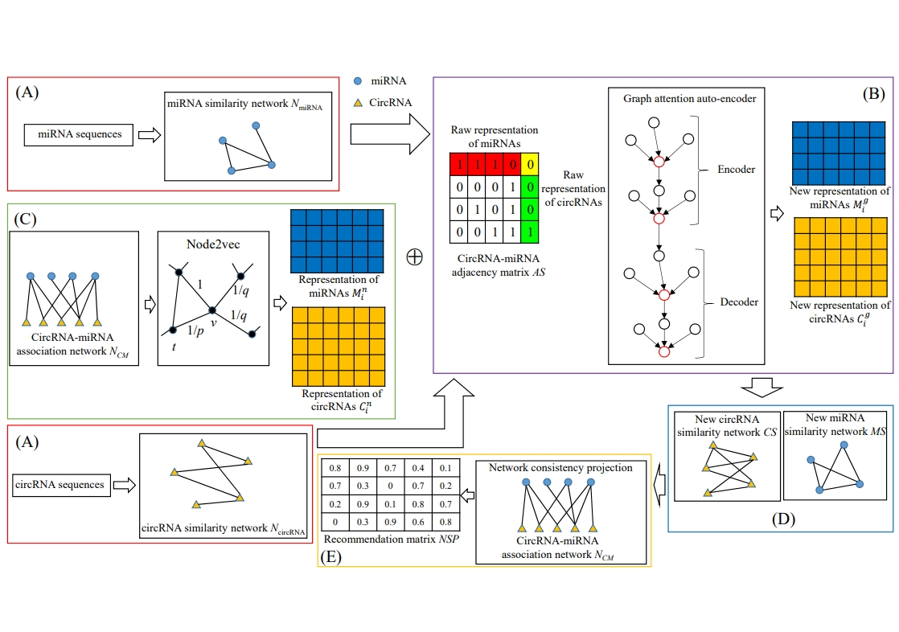

# CMAGN
The model CMAGN is designed for predicting circRNA-miRNA associations. It first constructs the similarity networks for circRNAs and miRNAs based on their sequences. Then, graph attention auto-encoder is applied to these networks for generating the first representations of circRNAs and miRNAs. At the same time, the second representations of circRNAs and miRNAs are obtained from circRNA-miRNA association network via node2vec. The similarity networks of circRNAs and miRNAs are reconstructed based on above two new representations. Finally, network consistency projection is applied on the reconstructed similarity networks and circRNA-miRNA association network to generate the recommendation matrix.

## Data
The "data" folder contains the raw circRNA-miRNA interactions obtained from the **circBank** database (http://www.circbank.cn/). Additionally, it includes sequence similarity information and association matrix information derived from further processing of these interactions.

## Requirements
- python = 3.9
- Tensorflow = 2.5.0
- scikit-learn = 0.24
- node2vec = 0.4.6 

## Quick start

Run main.py to Run CMAGN